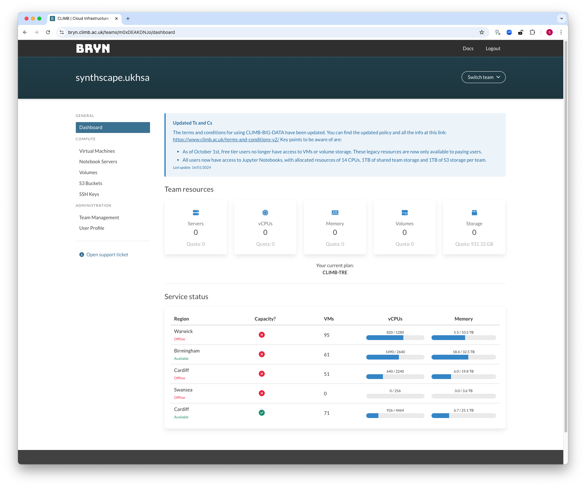
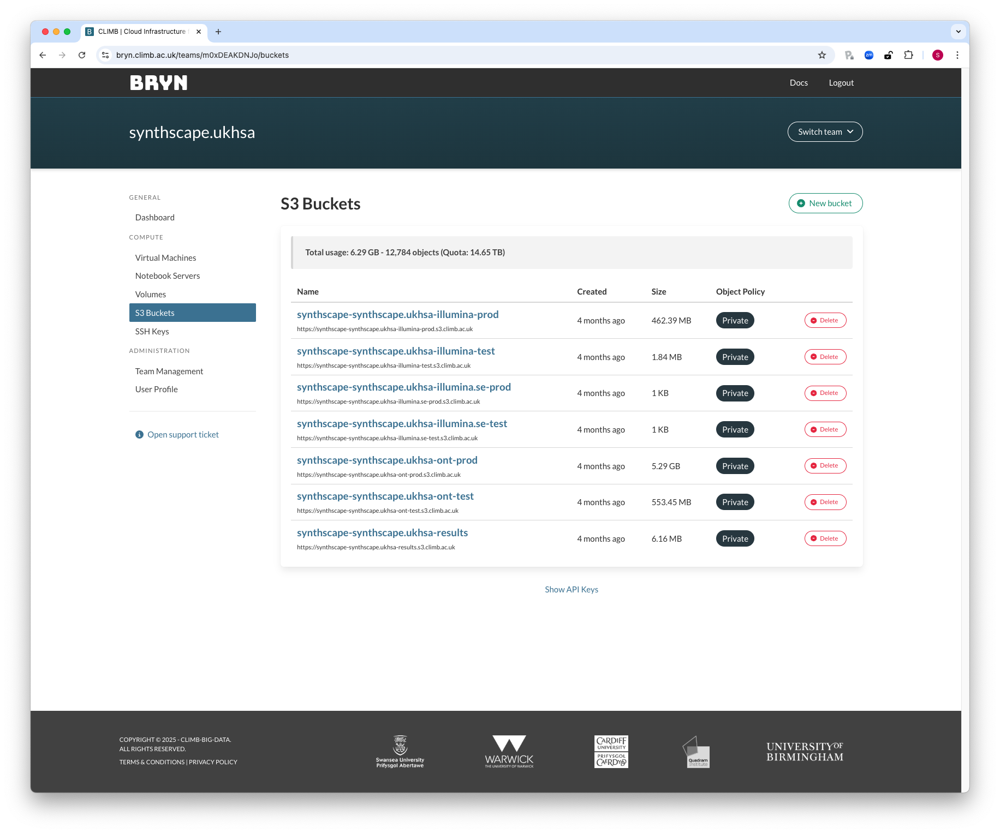
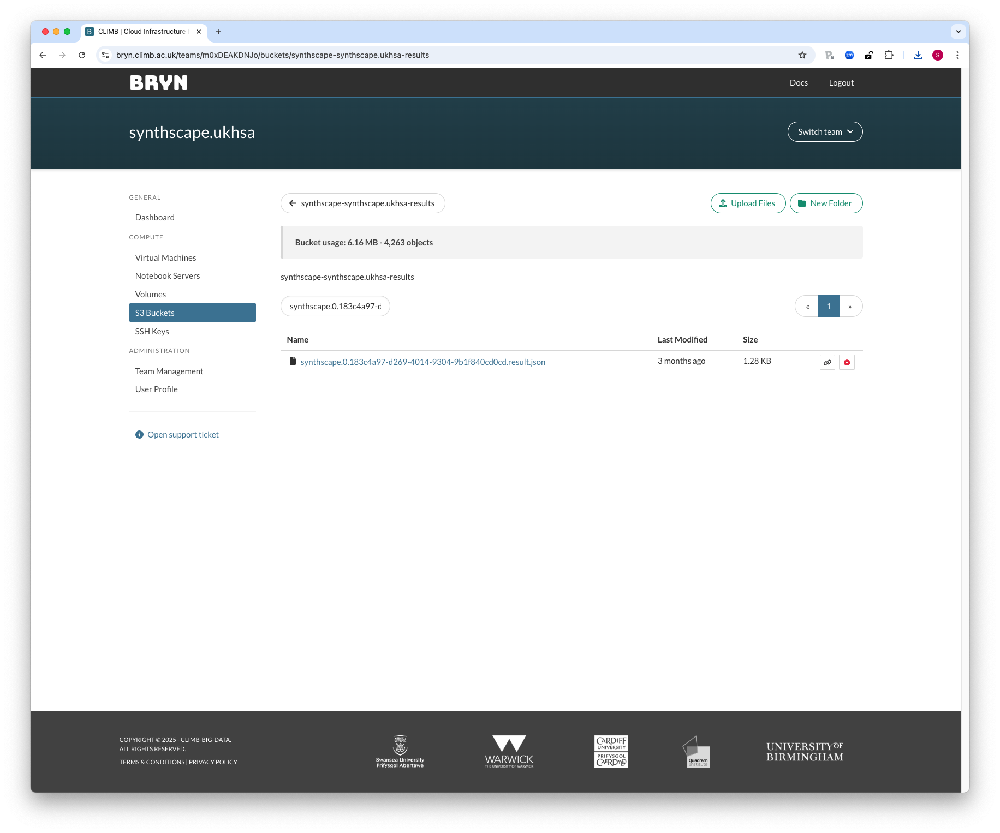

# Checking Results After Submitting Data

## Bryn GUI

The Bryn GUI is the simplest way to check on the status of submitted data for most users. To do so, simply log in to [Bryn](https://bryn.climb.ac.uk/).


Once there navigate to the "S3 Buckets" menu on the left which should look like this:


Then select the results bucket by clicking on it, the name of the results bucket will differ based on the CLIMB-TRE project and which site you belong to but the layout will be: `{project}-{bryn tenant name}-results`. Once you click on the bucket you should see a page like this:


There will be up to two types of file present in this S3 bucket; result JSON files and linkage JSON files.
* Result JSON files are named with the following pattern: `{project}.{run_index}.{run_id}.result.json` and contain all the relevant information about your sample including errors during the ingest process, issues with the metadata CSV, etc.
* Linkage JSON files are named with the following pattern: `{project}.{run_index}.{run_id}.linkage.json`, these are only generated once when the ingest for that run_index and run_id has been successful and the artifact has been ingested into the dataset. It contains data which can be used to link the submitted file names with the anonymised identifiers in the main dataset, you are responsible for maintaining this linkage information and have the ability to delete it from your results bucket, if you do and lose linkage **we WILL NOT be able to establish linkage for you**. 

To find the result for a specific artifact you can search, the search function requires a full match from the start of the file name, e.g. for a file named `synthscape.1.some_run_id.result.json`
* `1.some_run_id` **will not** match the file
* `synthscape.1.some_run_id` **will** match the file



Once you have found the result / linkage file you are interested in you can download it by clicking on it, be aware, these files contain private identifiers and should be treated as sensitive, we take no responsibility if you do not follow data security procedures for your trust / organisation.

A result JSON will look similar to this:

```
{
  "uuid": "f84ae65d-ec57-443a-946f-6af34bace889",
  "site": "synthscape",
  "raw_site": "synthscape.ukhsa",
  "uploaders": [
    "bryn-synthscape-ukhsa"
  ],
  "match_timestamp": 1.7286538918609505e+18,
  "artifact": "synthscape|0|183c4a97-d269-4014-9304-9b1f840cd0cd",
  "run_index": "0",
  "run_id": "183c4a97-d269-4014-9304-9b1f840cd0cd",
  "project": "synthscape",
  "platform": "ont",
  "files": {
    ".csv": {
      "uri": "s3://synthscape-synthscape.ukhsa-ont-prod/synthscape.0.183c4a97-d269-4014-9304-9b1f840cd0cd.csv",
      "etag": "0b17ccec938f4876029972c4d37dba72",
      "key": "synthscape.0.183c4a97-d269-4014-9304-9b1f840cd0cd.csv",
      "submitter": "bryn-synthscape-ukhsa",
      "parsed_fname": {
        "project": "synthscape",
        "run_index": "0",
        "run_id": "183c4a97-d269-4014-9304-9b1f840cd0cd",
        "ftype": "csv"
      }
    },
    ".fastq.gz": {
      "uri": "s3://synthscape-synthscape.ukhsa-ont-prod/synthscape.0.183c4a97-d269-4014-9304-9b1f840cd0cd.fastq.gz",
      "etag": "62adfae7ac5dcbcc3a770133e2bcf7e5",
      "key": "synthscape.0.183c4a97-d269-4014-9304-9b1f840cd0cd.fastq.gz",
      "submitter": "bryn-synthscape-ukhsa",
      "parsed_fname": {
        "project": "synthscape",
        "run_index": "0",
        "run_id": "183c4a97-d269-4014-9304-9b1f840cd0cd",
        "ftype": "fastq",
        "gzip": "gz"
      }
    }
  },
  "test_flag": false,
  "validate": false,
  "onyx_test_create_errors": {
    "source_climb_id": [
      "This CLIMB ID does not exist in mSCAPE."
    ]
  }
}
```

If the submission was successful there will be no `onyx_test_create_errors` or `ingest_errors` fields present and the `created` / `published` fields will both be "true".

Any metadata issues will be defined in the `onyx_test_create_errors` field separated by the field to which the issue applies, we hope that the errors should be fairly readable and self explanatory but if not the please contact the CLIMB-TRE team for assistance.

